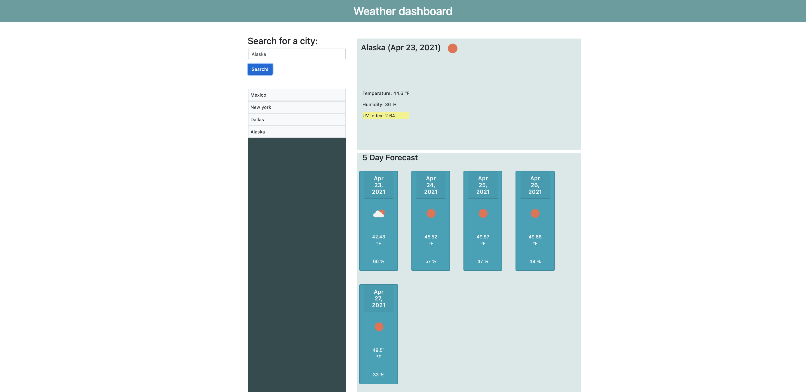

# Weather Dashboard
### Miranda Ramírez

## The task 

Purpose of the task is to use third-party APIs to generate a dashboard that retrieves weather data for cities. 
The user is presented a basic form with an input area for the city and a submit button to initalize the search, the dashboard presents both a forecast for today and a forecast for the next 5 days in said city. The dashboard features dynamically updated HTML and CSS. 

## Third party APIs

The next libraries were used to create the project:
* Moment.js
* jQuery
* OpenWeather One Call API
* Bootstrap 

## Deployed application

Image of the deployed application:

Link to the deployed application: 
[Public github page](https://mirandarmz.github.io/Weather-dashboard/) 

## Conlcusion

* Overall, it was a challenging assignment that allowed me to explore all of the knowledge gained so far. 